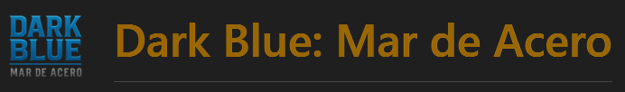

### &nbsp;&nbsp;*¡El destino de la humanidad está en tus manos! -   Una batalla épica bajo el del mar*
---
<h2 style="color: #3bfa; font-size: 22px;">
Descripción del Proyecto
</h2>

&nbsp;&nbsp;**Dark Blue: Mar de Acero** es un videojuego web inspirado en el clásico *"Hundir la Flota"*, reinventado y ambientado en un futuro distópico en guerra entre humanos y máquinas.

&nbsp;&nbsp;El jugador puede enfrentarse a:

- 🤖 **Una IA avanzada en modo campaña**
- 🌐 **Otros jugadores en tiempo real (player vs player) online**

&nbsp;&nbsp;El título ofrece:

- Tableros dinámicos
- Ataques especiales
- Chat integrado
- Animaciones
- Progresión completa del perfil
- Tienda online con créditos virtuales

&nbsp;&nbsp;El proyecto está dividido en:

- **Backend**: Spring Boot 3.5 + WebSockets + MongoDB
- **Frontend**: Angular 19 + Tailwind + Signals + RxJS

---

<h2 style="color: #3bfa; font-size: 22px;">
Tecnologías Principales
</h2>

## &nbsp;🛠 Backend
- **Java 17**
- **Spring Boot 3.5**
- Spring Security + JWT
- Spring WebSocket (STOMP)
- Spring Data MongoDB
- WebFlux
- Jakarta Validation
- Spring Mail
- Maven

## &nbsp;🎨 Frontend
- **Angular 19**
- Angular Signals
- RxJS
- Tailwind CSS 4
- SweetAlert2
- STOMP + SockJS
- Audio + animaciones CSS

---
<h2 style="color: #3bfa; font-size: 22px;">
Funcionalidades Principales
</h2>

## &nbsp;🔐 Autenticación y Seguridad
- Registro con **doble factor de autenticación (2FA)**
- Login con JWT
- Recuperación de contraseña
- Eliminación de cuenta
- Protección de endpoints REST y WebSocket con roles

---

## &nbsp;🧑‍💻 Perfil del Jugador
- Nivel y experiencia
- Créditos virtuales
- Estadísticas completas
- Equipamiento, skins, inventario
- Historial de partidas

---

## &nbsp;🤖 Modo Campaña (Player vs IA)
- IA inteligente con priorización de objetivos
- Disparos progresivos
- Uso de ataques especiales por la IA
- Recompensas de créditos para el jugador
- Tablero autogenerado con submarinos aleatorios

---

## &nbsp;🌐 Modo Online 1 vs 1 en Tiempo Real
- Sincronización mediante WebSockets (STOMP)
- Turnos, impactos y fallos en tiempo real
- Ataques especiales completamente sincronizados
- Chat interactivo dentro de la partida
- Sistema de abandono y compensación

---

## &nbsp;🔫 Sistema de Ataques Especiales
- **x2Shot** → doble disparo
- **MultiShot** → varios impactos simultáneos
- **LaserShot** → disparo en línea recta que revela/impacta casillas

Incluye efectos visuales, animaciones y sonidos exclusivos.

---

## &nbsp;💬 Chat Integrado
- Mensajería instantánea en partidas online
- Envío de logs del sistema al usuario

---

## &nbsp;💰 Tienda Online
- Compras con créditos virtuales y moneda real
- Items: ataques especiales, skins, mejoras
- Donaciones integradas

---

## &nbsp;🗃️ Persistencia Completa en MongoDB
&nbsp;&nbsp;&nbsp; Colecciones utilizadas:

- `users`
- `games`
- `perfiles`
- `items`

---
<h2 style="color: #3bfa; font-size: 22px;">
Arquitectura del Proyecto
</h2>

## &nbsp;📦 Colecciones MongoDB
| Colección | Contenido |
|----------|-----------|
| **users** | credenciales, 2FA, recuperación, email |
| **games** | partidas online y campaña |
| **perfiles** | estadísticas, nivel, inventario |
| **items** | artículos de tienda |

---

## &nbsp;🧩 Controladores REST principales

| Controlador | Funcionalidad |
|-------------|---------------|
| `/auth`     | Registro, login, 2FA, recuperación |
| `/game`     | Partidas campaña y online |
| `/perfil`   | Perfil, XP, skins |
| `/shop`     | Tienda virtual |
| Otros       | Utilidades internas |

---

## &nbsp;📡 WebSocket Topics
- `/topic/game/{gameId}`

---
## 🎨 Multimedia, Recursos y Licencias

### &nbsp;&nbsp;El proyecto utiliza:

 &nbsp;&nbsp;&nbsp;🖼️ Recursos gráficos

- Imágenes libres de derechos obtenidas de Pixabay
- Edición personalizada realizada por el desarrollador
- Generación de materiales mediante IA:
- Gemini 
- ChatGPT

&nbsp;&nbsp;&nbsp;🔊 Recursos de sonido

- Archivos propios
- Pistas de audio libres de derechos obtenidas de Pixabay
- Edición personalizada realizada por el desarrollador
- Recursos libres de derechos

---
<h2 style="color: #ffcf70; font-size: 22px;">
Instalación y Uso
</h2>

## &nbsp;📌 Frontend

```bash
git clone https://github.com/tu_usuario/dark-blue.git
cd dark-blue/dark-blue-front
npm install
ng serve

```
--- 

<h2 style="color: #3bfa; font-size: 22px;">
Créditos
</h2>

#### &nbsp;&nbsp;Developed by:
### &nbsp;&nbsp;&nbsp;Alberto Tabernero Valle

&nbsp;&nbsp;&nbsp;&nbsp;Desarrollador Fullstack (junior) 15/12/2025

### &nbsp;🔗 Contacto

&nbsp;&nbsp;&nbsp;&nbsp;📧 Email: atabernerovalle@gmail.com

&nbsp;&nbsp;&nbsp;&nbsp;💼 LinkedIn: http://www.linkedin.com/in/alberto-tabernero

&nbsp;&nbsp;&nbsp;&nbsp;🐙 GitHub: https://github.com/albeany

### 💙 ¡Gracias por probar Dark Blue: Mar de Acero!
---